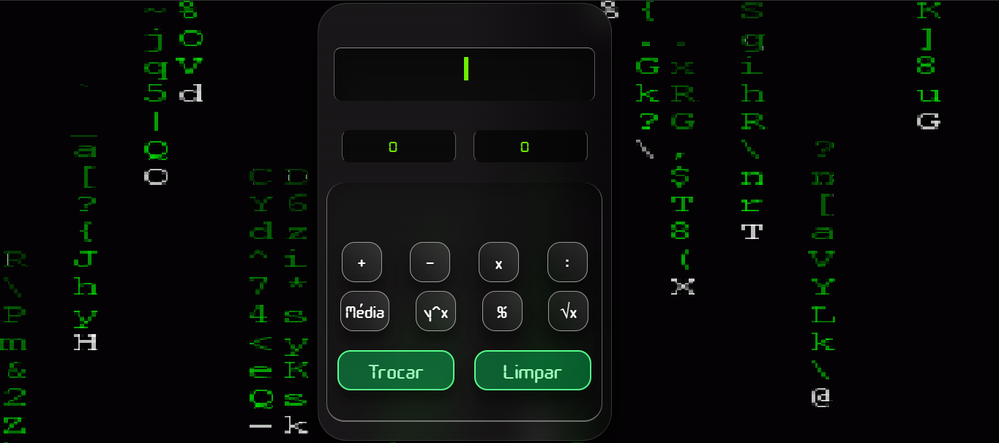
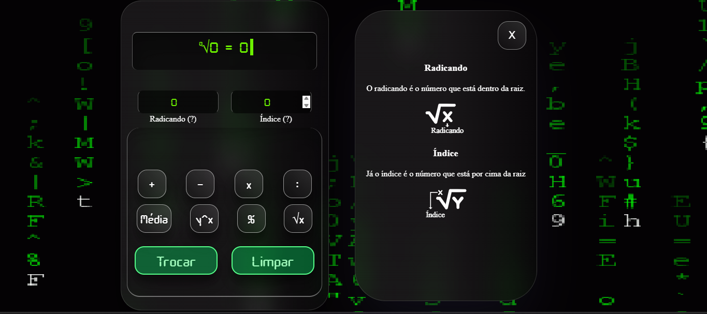

# 🧮 Mini Calulator (2024)

> A clean and interactive web-based calculator designed to perform basic operations between two numbers, with additional educational features for exponentiation and root calculations.

---

## 📸 Preview



Live Demo: <site-link>

---

## 🚀 Features

- ➕ Basic operations: addition, subtraction, multiplication, and division
- 🔢 Power and root calculations
- 🏷️ Dynamic labels for advanced operations:
  - Displays **base** and **exponent** during power operations
  - Displays **radicand** and **index** during root operations
- 📚 Interactive help system:
  - Clicking on labels opens a side panel explaining each mathematical term
- 🧼 Clear button to reset inputs and results
- 🔄 Swap button to switch input values

---

## 🛠️ Technologies

- HTML
- CSS
- JavaScript (Vanilla)

---

## ⬇️ Installation

```bash
# Clone the repository
git clone https://github.com/samuel-fsilva/mini-calculator

# Enter the folder
cd mini-calculator
```

---

## ⚙️ Usage

- Download and unzip or clone the project
- Open index.html in your browser
- Enjoy!

---

## 📂 Project Structure

```
project/
│── css/
│   └── custom.css
│   └── index.css
│   └── info.css
│── font/
│── js/
│   └── custom.js
│   └── index.js
│── index.html
│──
│── README.md
```

---

## 🗺️ Roadmap

 - [ ] 🎨 Theme customization (dark/light modes)
 - [ ] 📱 Improved mobile responsiveness
 - [ ] ⌨️ Keyboard input support

---

## 🙋‍♂️ Author

GitHub: https://github.com/samuel-fsilva
